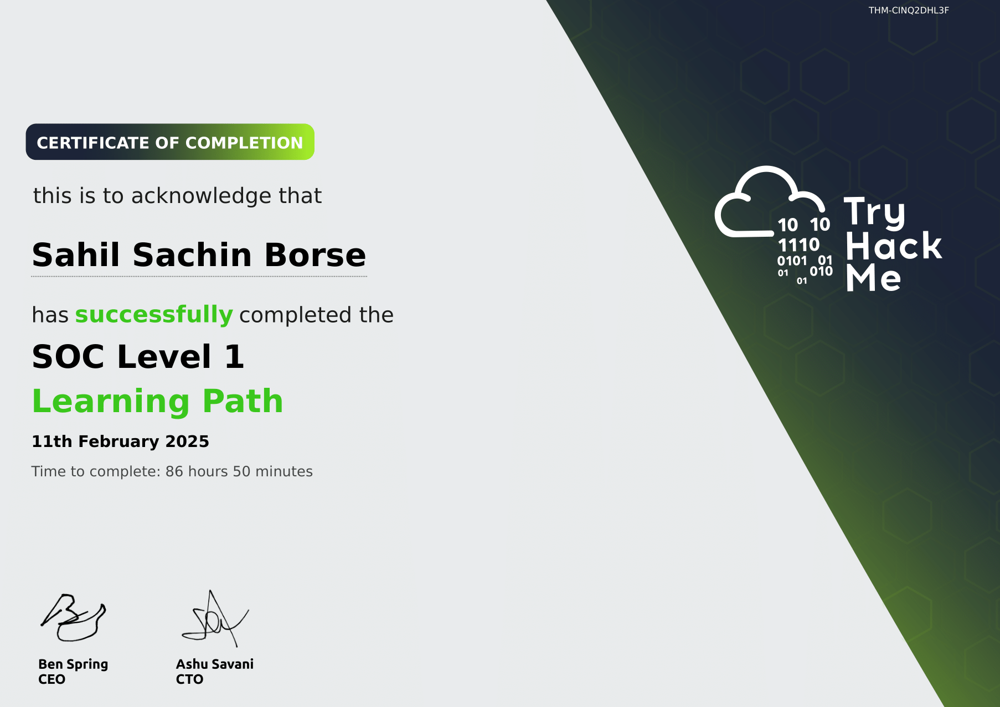

# SOC Training

## Certificate of Completion

This repository contains the certificate of completion for the SOC Training program. The training covered various aspects of Security Operations Center (SOC) monitoring, incident response, and cybersecurity best practices.

  

## Training Details

- **Training Name:** SOC Training
- **Platform:** [Mention the platform, e.g., TryHackMe, Cybrary, etc.]
- **Completion Date:** [Your completion date]
- **Duration:** [Total hours spent]

## Skills Acquired

During the training, I developed skills in:

- Security event monitoring and analysis
- Incident detection and response
- Log analysis using SIEM tools
- Threat intelligence and hunting
- Network traffic analysis
- Handling real-world SOC scenarios

## Certificate Verification

You can verify my certificate using the following link:

[Certificate Verification Link](https://tryhackme-certificates.s3-eu-west-1.amazonaws.com/THM-CINQ2DHL3F.pdf)  

## Repository Contents

- `SOC-training_cert-1.png` - The certificate of completion
- `README.md` - This file describing the training and certificate

---

> *"Cybersecurity is about staying one step ahead, not just following the rules."* 🔐
